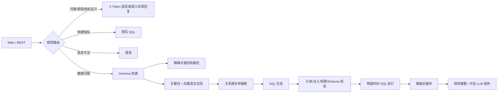

# 电商数据分析 Agent

面向作品集与企业 PoC 的电商经营分析项目。核心不是“所有功能都用 Agent”，而是按任务确定性选择 **Agent、领域服务或工作流**，并保留 Web、REST 与 MCP 接入边界。

## 项目定位

- 用 Agent 处理自然语言问数、澄清、Schema 检索、SQL 生成与工具编排。
- 用确定性领域服务计算 GMV、客单价、转化率、退款率、毛利率等指标。
- 用固定工作流执行日报、异常扫描、低库存任务和商品风险复核。
- 用统一语义层、权限、脱敏、审计和评测保证结果可解释、可治理。

## 当前保留模块

| 模块 | 实现方式 | 是否调用 LLM | 说明 |
|---|---|---:|---|
| 智能问数 | Agent | 按需 | 路由、澄清、混合 Schema 检索、NL2SQL、校验、执行、图表 |
| 快捷指标 | 规则 + 预写 SQL | 否 | 高频问题走毫秒级快路径 |
| 指标语义层 | 领域服务 | 否 | 指标口径、公式、版本、维度和字段映射 |
| 店铺/商品诊断 | 领域服务 | 否 | 基于事实和阈值输出风险、证据和建议 |
| 经营驾驶舱 | 聚合服务 | 否 | 指标、趋势、异常和待办 |
| 版本化报告 | 工作流 + 可选摘要 | 默认否 | 事实先生成，LLM 仅做可选文字润色 |
| 自动化中心 | 工作流 | 默认否 | 触发、条件、动作、重试、任务与运行记录 |
| 数据接入与质量 | 确定性服务 | 否 | 文件检查、字段映射、标准化、快照和质量评分 |
| 企业接入 | REST + MCP | 否 | 保留稳定能力目录和确定性工具接口 |
| 评测与反馈 | 测试/评测服务 | 否 | Golden Case、路由/检索/SQL/结果指标和人工反馈 |

## 已移出主项目

- 企业知识库 RAG 与通用联网搜索。
- Amazon、京东爬虫及浏览器登录会话。
- 竞品、选品和市场情报。
- 旧 `business_intelligence.py`、`auto_analysis.py` 与 `/api/bi/*`。
- 旧日报/月报兼容接口和重复 WebSocket 查询入口。

Schema 向量检索仍属于 NL2SQL 核心能力，因此 ChromaDB/Milvus 和本地 Embedding 依赖继续保留。

## 核心链路



## 延迟与 Token 策略

- 问候、帮助、已登记指标定义：`0` 次模型调用。
- 快捷查询、驾驶舱、诊断和工作流：默认 `0` 次模型调用。
- 明确数据问题：通常只调用 SQL 生成模型一次。
- 模糊问题：先澄清，不生成 SQL。
- SQL 修复：最多一次，避免无限重试和 Token 放大。
- 查询摘要：默认规则生成；只有 `NL_ANSWER_LLM=true` 才调用模型润色。
- Schema：明确高置信请求走关键词快路径；其余融合关键词和向量，向量故障时关键词兜底。

## 安全与治理

- 认证公共路径使用精确匹配，避免 `/` 前缀导致全站绕过。
- SQL 校验包含语法、注入、只读、表权限和 Schema 五道闸门。
- SQLite 使用 progress handler 按截止时间中断查询。
- 查询结果先脱敏再缓存。
- 缓存键包含租户、用户权限、数据源、Schema、模型和 Prompt 版本。
- 生产模式缺少认证密钥、集成 Token 或模型密钥时拒绝启动。
- Trace 对 Token、手机号和邮箱做脱敏。

## 目录

```text
backend/
  agent/          # 路由、Schema 检索、NL2SQL、校验、工作流
  api/            # Web、报告、工作流、语义层、集成和评测 API
  capabilities/   # Agent / 领域服务 / 工作流能力注册表
  domain/         # 指标语义与电商领域模型
  services/       # 看板、报告、标准化、质量、工作流存储
  workflows/      # 自动化模板和模型
  middleware/     # 认证、限流和熔断
  tracing/        # Trace 与观测
  eval/           # Golden Case 与评测执行器
frontend/         # Web 工作台
docs/             # 企业级整改方案和实施规划
```

## 环境配置

复制 `.env.example` 为 `.env`，至少配置：

```env
APP_ENV=demo
LLM_API_KEY=
LLM_BASE_URL=https://api.deepseek.com
LLM_MODEL=deepseek-v4-flash
NL_ANSWER_LLM=false
AUTH_ENABLED=false
JWT_SECRET=
INTEGRATION_TOKEN=
```

生产环境使用 `APP_ENV=production`，并设置强随机 `JWT_SECRET`、`INTEGRATION_TOKEN`，同时开启认证。

## 启动

```powershell
cd backend
..\.venv\Scripts\python.exe main.py
```

默认入口：

- Web：`http://127.0.0.1:8100`
- OpenAPI：`http://127.0.0.1:8100/docs`
- MCP：由 `MCP_TRANSPORT`、`MCP_HOST`、`MCP_PORT` 配置

## 主要接口

- `POST /api/query`：智能问数。
- `POST /api/query/stream`：SSE 智能问数。
- `POST /api/quick/{query_key}`：0 Token 快捷查询。
- `/api/dashboard/*`：经营驾驶舱。
- `/api/diagnostics/*`：店铺和商品诊断。
- `/api/workflows/*`：自动化定义与运行。
- `/api/reports/*`：版本化报告。
- `/api/semantic/*`：指标和实体语义层。
- `/api/standardization/*`：标准化与快照。
- `/api/integrations/v1/*`：企业系统稳定接口。
- `/api/evaluations/*`：Golden Case 评测。

## 验证

```powershell
cd backend
..\.venv\Scripts\python.exe -m pytest tests -q
```

详细整改与验收项见 `docs/ENTERPRISE_AGENT_IMPROVEMENT_PLAN.md` 和 `docs/MASTER_IMPLEMENTATION_PLAN.md`。